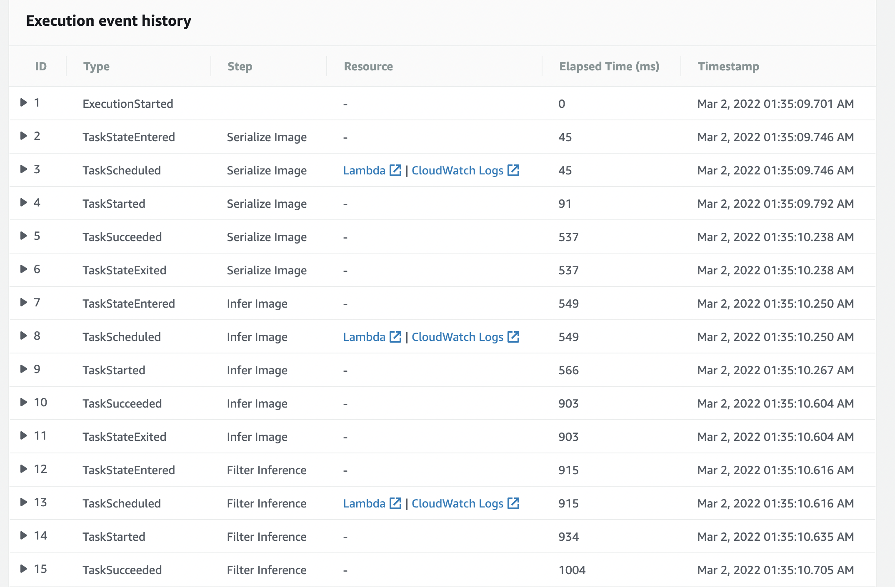
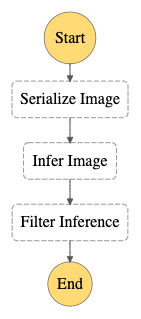
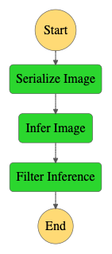
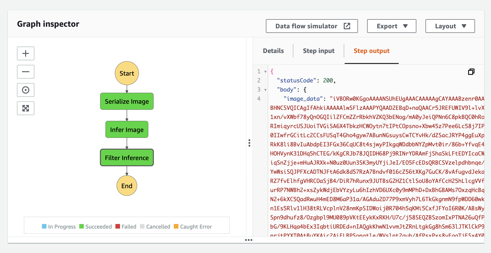

# scones-unlimited
Stores code and results for the "Build ML Workflow For Scones Unlimited" project in the Udacity AWS MLE Nanodegree

## Deploy ML Workflow with AWS
The project aims to deploy a functioning ML workflow for image classification using AWS. Specifically, the project involved -
* Building an image classification model that can tell bicycles apart from motorcycles.
* Deploying the trained model to an endpoint.
* Using AWS Lambda Functions to build services to serialize the data, perform inference, and filter out weak inferences.
* Using AWS Step Functions to create an ML workflow to stich the above services together into an event-driven application.

## Execution Flow of Step Functions

## Step Function Workflow
  

## Step Function Output

